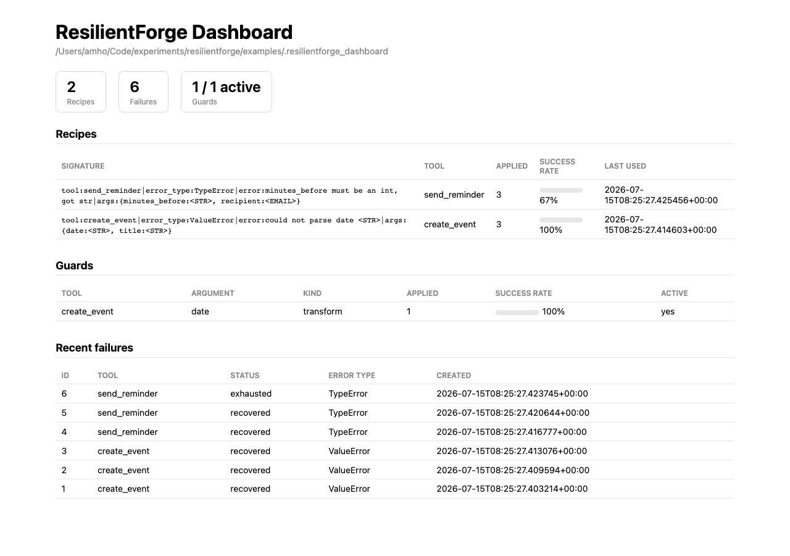

# ResilientForge

**Status:** Phase 1 (MVP), Phase 2 (standing guards + continuous checks),
Phase 3 (speculative branching), and Phase 4 (sandboxed isolation + a local
dashboard — oracle federation deferred) complete. Not yet published to PyPI.

ResilientForge is a small, framework-agnostic Python library that sits on top of an
agent's existing tool-calling loop and adds **persistent, cross-run failure memory**.

When a wrapped agent hits a tool failure or violates a defined invariant,
ResilientForge captures the failure, checks a local failure oracle for a
previously-successful fix, applies it if found — no model call needed — and,
if it has to generate a new fix via a model call, writes that fix back to
the oracle so the next occurrence of the same failure *shape* is resolved
without another model call, even if the specific values involved are
different. Once a fix has proven itself reliably enough times, it's
promoted into a **standing guard** that fixes the arguments *before* the
tool is even called — the failure stops recurring at all, instead of
recurring once and then being fixed on retry.

See [`docs/architecture.md`](./docs/architecture.md) for how it actually
works under the hood.

## Does it work? Real numbers, not a claim

The table below is generated by `pytest tests/failure_injection` — seven
scenarios reproducing the real-world failure patterns this project targets
(malformed tool-call JSON, a missing required field, a natural-language date
where ISO 8601 was expected, a transient timeout, a wrong-typed argument, a
longer-running recurring-date scenario built specifically to demonstrate
guard promotion, and a scenario whose correct fix can't be guessed from the
arguments alone, built to demonstrate speculative branching), each run once
with **no** recovery mechanism (baseline) and once wrapped with
ResilientForge, with different literal values per trial:

| Scenario | Trials | Baseline recovery | Recovery (ResilientForge) | Avg attempts to recovery | Oracle hit rate (after 1st occurrence) | Guard promoted | Prevention rate | Avg candidates considered |
|---|---|---|---|---|---|---|---|---|
| malformed_json_args | 5 | 0% | 100% | 0.6 | 100% | yes | 100% | 0.2 |
| missing_required_field | 5 | 0% | 100% | 0.6 | 100% | yes | 100% | 0.2 |
| natural_language_date | 5 | 0% | 100% | 0.6 | 100% | yes | 100% | 0.2 |
| transient_timeout | 5 | 0% | 100% | 1.0 | 100% | no | 0% | 0.2 |
| wrong_type_argument | 5 | 0% | 100% | 0.6 | 100% | yes | 100% | 0.2 |
| recurring_date_guard | 8 | 0% | 100% | 0.4 | 100% | yes | 100% | 0.1 |
| ambiguous_fix_candidates | 6 | 0% | 100% | 2.2 | 0% | no | 0% | 2.2 |

The "oracle hit rate" column is Phase 1's proof: after the *first*
occurrence of a given failure shape is recovered once (which needs one
model call), every later occurrence — even with completely different
literal values — resolves via the oracle with **zero additional model
calls**. The next two columns are Phase 2's proof: once a fix has been
applied reliably enough times (3, by default), it's promoted into a
**standing guard** that fixes the arguments *before* the tool is even
called — `transient_timeout` is the one scenario where no guard is
promoted, because its correct "fix" is just a blind retry with no argument
to change. `recurring_date_guard` is the dedicated demonstration: 8 trials,
the first 3 cross the promotion threshold reactively, the remaining 5 use
dates never seen before and are all *prevented* outright, not merely
recovered from. The last column is Phase 3's: `ambiguous_fix_candidates`
still recovers 100% of trials via real, per-candidate verification, at a
real, reported cost — unlike every other scenario, its oracle hit rate is
0%, because considering multiple candidates means a model call is made
every round regardless of whether a recipe already exists. Regenerate this
table yourself with `pytest -s tests/failure_injection` (also written to
`tests/failure_injection/reports/latest.md`).

## Quickstart

```bash
pip install resilientforge
```

```python
from resilientforge import wrap

def create_event(date: str, title: str = "Event") -> dict:
    import re
    if not re.match(r"^\d{4}-\d{2}-\d{2}$", date):
        raise ValueError(f"could not parse date '{date}'")
    return {"date": date, "title": title, "status": "created"}

def reflect(context):
    # Stand-in for a real model call — see integrations/raw_tool_loop.py's
    # create_anthropic_reflect() for a real Anthropic-backed one.
    return {
        "strategy": "reformat_argument",
        "transforms": [{"argument": "date", "transform": "parse_relative_date_to_iso"}],
    }

wrapped = wrap(create_event, reflect=reflect)

wrapped.invoke(date="next Friday", title="Standup")
# -> {"date": "2026-07-17", "title": "Standup", "status": "created"}
# (recovered: date wasn't ISO 8601, reflect() proposed reparsing it, retried, succeeded)

wrapped.invoke(date="next Tuesday", title="Retro")
# -> {"date": "2026-07-21", "title": "Retro", "status": "created"}
# (recovered via the recipe learned above — reflect() was NOT called again)
```

That's the raw tool-calling loop integration — the simplest entry point,
and the reference implementation. For a real Anthropic tool-use loop, an
OpenAI function-calling loop, or a LangGraph `ToolNode`, see
`integrations/raw_tool_loop.py` / `integrations/langgraph_adapter.py` and
the runnable demos in `examples/`:

```bash
python examples/raw_loop_demo.py
python examples/langgraph_demo.py
python examples/guards_demo.py
```

## Standing guards: prevention, not just recovery

Once a fix has succeeded reliably enough times (3, by default), it's
promoted into a **standing guard** that proactively fixes the arguments
*before* the tool is even called — the failure stops happening at all,
instead of happening once and then being fixed on retry:

```python
wrapped = wrap(create_event, reflect=reflect, guard_promotion_min_occurrences=3)

wrapped.invoke(date="next Friday", title="A")   # recovers via reflect()
wrapped.invoke(date="next Tuesday", title="B")  # recovers via the fast-path recipe
wrapped.invoke(date="next Monday", title="C")   # recovers, and this 3rd success promotes a guard

wrapped.invoke(date="next Wednesday", title="D")
# -> succeeds on the FIRST attempt — no failure is even recorded for it,
#    and reflect() is not called: the guard fixed the date before the call.
```

Guards are stored the same way recipes are — locally, per oracle — and can
be inspected/revoked with the CLI, or described as text for you to splice
into your own system prompt (ResilientForge never touches a prompt itself
— see the "Standing guards" section in
[`docs/architecture.md`](./docs/architecture.md)):

```bash
resilientforge guards list
resilientforge guards describe
```

Add invariants to catch failures that don't raise an exception (e.g. a
result that's missing a required field):

```python
from pydantic import BaseModel
from resilientforge import Invariant, wrap

class EventResult(BaseModel):
    title: str
    attendees: list[str]

wrapped = wrap(
    my_agent,
    invariants=[Invariant.from_pydantic_model("valid_event", EventResult)],
)
```

See [`docs/writing_invariants.md`](./docs/writing_invariants.md) for the
full interface (deterministic, Pydantic-schema, and LLM-judged invariants,
plus `on_violation="recover"|"abort"|"warn"`).

## Speculative branching: considering more than one fix

By default, a failed call gets exactly one candidate fix per attempt. Ask
for more with `num_branches`, and the tool is still only ever called for
real **once per attempt** — candidates are ranked by a recipe's real
`success_rate` when one exists, so this never risks a duplicate real-world
side effect:

```python
wrapped = wrap(create_event, reflect=reflect, num_branches=3)
```

If your tool has no problematic real-world effect regardless of which
arguments it's called with (a pure computation, a read-only lookup, a
validation — **not** anything that books, sends, charges, or deletes for
real), opt in to `side_effect_free=True` and ResilientForge will actually
try each candidate for real, in ranked order, until one fully passes your
invariants — genuine verification, not a guess:

```python
wrapped = wrap(compute_something, reflect=reflect, num_branches=3, side_effect_free=True)
```

See the "Speculative branching" section in
[`docs/architecture.md`](./docs/architecture.md) for the full design,
including why the flag isn't called `idempotent`.

## Sandboxed isolation: a hang or crash shouldn't take down your agent

`isolate=True` runs every real tool call in a freshly-spawned subprocess,
with an optional wall-clock deadline — a hang or a crash becomes a normal
recoverable failure instead of blocking or killing your process:

```python
wrapped = wrap(create_event, reflect=reflect, isolate=True, call_timeout=5.0)
```

This protects the *caller*, not the world the tool touches — it cannot
undo a real-world side effect the tool already performed before it hung
or crashed (no code-level sandbox can). It also requires `tool_fn` to be
picklable (checked eagerly, at `wrap()` time): a module-level function or
a bound method works; a locally-defined closure or lambda does not.
POSIX-only, best-effort resource ceilings are available too:

```python
wrapped = wrap(create_event, reflect=reflect, isolate=True,
                max_memory_mb=512, max_cpu_seconds=10)
```

See the "Sandboxed isolation" section in
[`docs/architecture.md`](./docs/architecture.md) for the full design,
including why resource caps are best-effort even on POSIX systems (an
empirically-confirmed, not hypothetical, caveat) and why this isn't
available through the LangGraph adapter.

## Local dashboard: the oracle's contents, in a browser

```bash
pip install resilientforge[dashboard]
resilientforge dashboard --oracle-path .resilientforge
```

Opens a small, read-only, GET-only view of the same recipes/guards/
failure history the CLI already exposes — binds to `127.0.0.1` by
default. `fastapi`/`uvicorn` are only pulled in by this extra, never a
hard dependency of the base package. Try it against seeded example data:

```bash
python examples/dashboard_demo.py
resilientforge dashboard --oracle-path examples/.resilientforge_dashboard
```



This is `examples/dashboard_demo.py`'s seeded data, viewed in a browser —
every number here is real, produced by actually running the recovery
loop, not mocked for the screenshot. What each part means:

- **Stats bar** — the oracle's size at a glance: how many distinct
  failure *shapes* have a known fix (**Recipes**), how many raw
  occurrences have ever been recorded (**Failures**), and how many
  standing guards exist and are currently active.
- **Recipes** — the actual cache of "failure shape → working fix." Each
  row is one *signature* (a normalized failure shape, not one specific
  literal value — see `docs/architecture.md`'s "Signature normalization"
  section), the tool it belongs to, how many times it's been applied,
  and its **success rate**: `create_event` is 100% (every replay of its
  learned date-reparsing fix has worked); `send_reminder` is 67% (2 of
  its 3 applications worked — the third hit a value no transform could
  fix, see below). This success rate is exactly what standing guards use
  to decide whether a fix is reliable enough to promote.
- **Guards** — fixes that have proven themselves reliable enough (3+
  applications, ≥80% success by default) to apply *before* the tool is
  even called, not just on retry after a failure. The one row here means
  `create_event`'s date-reparsing fix no longer costs a failed attempt
  at all — new occurrences succeed on the first try.
- **Recent failures** — the raw audit trail: every occurrence, whether
  it ultimately recovered or was exhausted. The one `exhausted` row is
  `send_reminder` being called with a value no transform could coerce
  into an int (`minutes_before="not-a-number"`) — a genuine failure
  ResilientForge correctly gave up on instead of fabricating a fix,
  exactly the "know when it hasn't worked" guarantee the rest of this
  README describes.

Together, this is the tangible result of the project: a local, growing,
inspectable memory of what's gone wrong and what fixed it — not a claim,
something you can open in a browser and look at yourself.

## Inspecting the oracle

```bash
resilientforge list                    # recipes learned so far
resilientforge list --failures         # raw failure history
resilientforge inspect <signature>     # full detail for one recipe (prefix match OK)
resilientforge prune --dry-run         # preview what pruning would remove
resilientforge stats                   # counts + resolution-status breakdown
resilientforge dashboard               # read-only web view of all of the above (Phase 4)

resilientforge guards list             # standing guards (Phase 2)
resilientforge guards inspect <tool> <argument>
resilientforge guards revoke <tool> <argument>
resilientforge guards describe         # text to splice into your own system prompt
```

## Installation

```bash
pip install resilientforge               # raw Anthropic/OpenAI tool-loop adapter
pip install resilientforge[langgraph]    # + the LangGraph adapter
pip install resilientforge[dashboard]    # + the local web dashboard
```

## Development

```bash
pip install -e ".[dev,langgraph,dashboard]"
pytest tests/unit tests/integration          # fast, no network — default CI gate
pytest tests/failure_injection                # the recovery-rate proof above
pytest -m live                                 # opt-in, real API calls
```

See [`CONTRIBUTING.md`](./CONTRIBUTING.md) for more, including how to add a
new failure-injection scenario.

## License

Apache 2.0 — see [`LICENSE`](./LICENSE).
